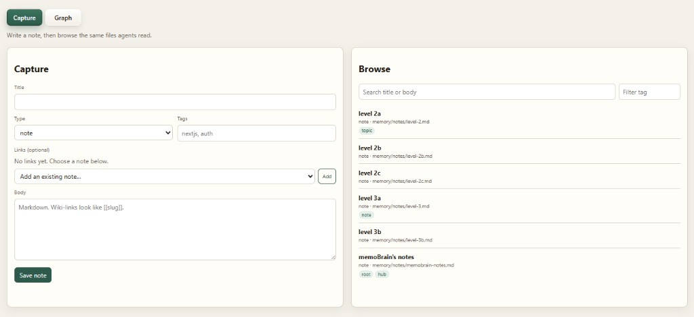
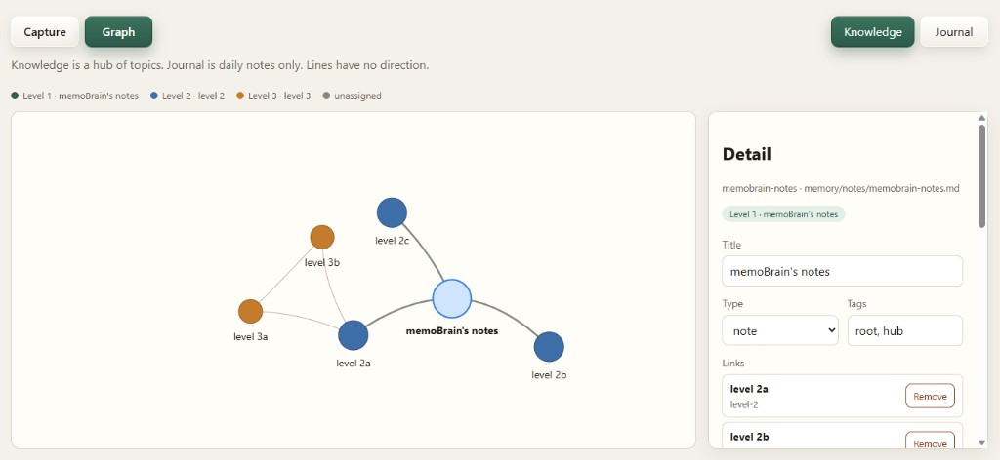

# memoBrain

A lightweight local knowledge base. Humans write `.md` / `.json` under `memory/`. AI agents read the same files. The UI is an optional helper, not the source of truth.

No model connection is required.

## UI preview

**Capture + browse** — write notes and search the same files agents read.



**Graph** — knowledge hub with level colors, link picker, and inline edit/delete.



## Requirements

- Node.js 20+

## First-time setup

1. **Set your root hub** in `memory.config.yaml`:

```yaml
graph:
  rootHub:
    id: memobrain-notes          # must match the root note filename (without .md)
    title: "memoBrain's notes"
  maxLevel: 3
```

2. **Edit or rename** the sample root note at `memory/notes/memobrain-notes.md` if you change `rootHub.id`.
3. Install and index:

```bash
npm install
npm run sync
npm run dev
```

Open http://127.0.0.1:3333

## Commands

| Command | Purpose |
|---------|---------|
| `npm run sync` | Scan `memory/` and write `scripts/index/catalog.json` + `graph.json` |
| `npm run validate` | Warn on duplicate IDs and broken `links` |
| `npm run search -- keyword` | Keyword search in title/body (`--tag name` optional) |
| `npm run dev` | Serve the UI at http://127.0.0.1:3333 |

The UI binds to `127.0.0.1` only. On the graph page, click a node to read, edit, or delete that file, or add a new note linked to it. **Delete removes the `.md` or `.json` file from disk.**

### Graph tabs

| Tab | What it shows |
|-----|----------------|
| **Knowledge** | `memory/notes/`, `memory/projects/`, `memory/entities/` (excludes journal) |
| **Journal** | Daily files in `memory/journal/` |

The knowledge graph starts from the **root hub** configured in `memory.config.yaml`:

| Level | Default label | Sample file |
|-------|---------------|-------------|
| 1 | memoBrain's notes | `memory/notes/memobrain-notes.md` |
| 2 | level 2 | `memory/notes/level-2.md` |
| 3 | level 3 | `memory/notes/level-3.md` |

Levels are computed by walking links (and optional frontmatter `parent`) from the root. Same level uses the same color. Notes not reachable from the root stay **unassigned** (gray) and can be attached with **Set as topic under root**.

**Level colors and labels** live in `memory.config.yaml` under `graph.levels` (up to `maxLevel`, default 3), plus `graph.unassigned` and `graph.journal`. Restart `npm run dev` after config changes.

Edges are **undirected lines**. If A and B both link to each other, the graph draws one line, not two arrows.

## Layout

```text
memory/                 source of truth
  notes/                evergreen Markdown
  entities/             one JSON object per file
  journal/              daily Markdown
  projects/             project registry
scripts/index/          generated cache (gitignored)
scripts/cli/            sync, search, validate
scripts/ui/             localhost capture + graph
```

## Notes

- Default note ID is the filename without extension.
- Wiki-links (`[[slug]]`) and frontmatter/JSON `links` become graph edges.
- For a private notes repo: push `memory/` to GitHub; pull before editing on another laptop.
- AI stays off (`ai.enabled: false` in `memory.config.yaml`). The config only opens a door for later.

Agents: read `.agent/README.md`.
